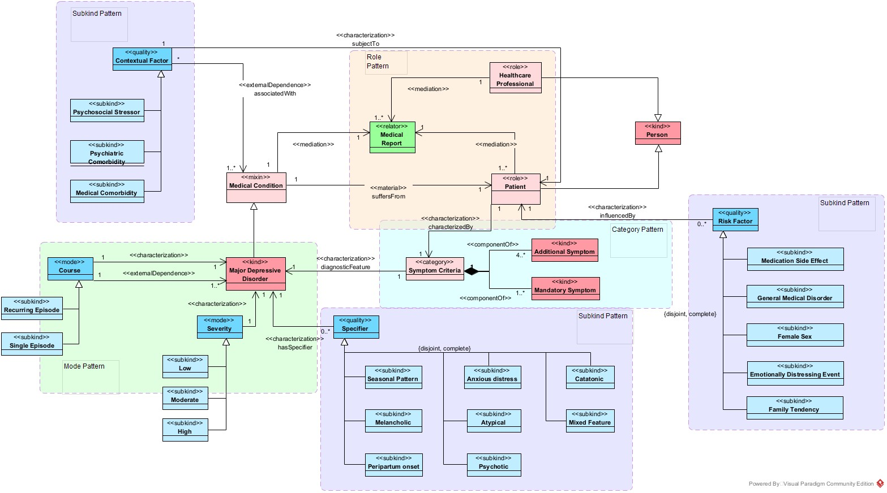

<h1 align="center">MDD Ontology</h1>

## Purpose
Provide a formal structure to represent knowledge about major depressive disorder, its diagnosis, symptoms and treatments.

## Scope
This ontology applies to modeling concepts related to depression, including its symptoms, diagnosis and treatments.

## Language
The ontology was developed using the OWL language (Web Ontology Language).

## Inteded users

1. Mental health professionals (psychologists, psychiatrists, etc.) who want automated support for diagnosis and treatment.
2. Academic researchers interested in studying and modeling major depressive disorder in different populations.
3. Developers of artificial intelligence systems for mental health, who need a formal representation of knowledge about major depressive disorder.
4. Patients and caregivers, who may benefit from tools that use the ontology to provide more accurate information about the condition.

## Intended uses

1. Structure data on patients with major depressive disorder, facilitating diagnosis and treatment.
2. Create recommendation systems for personalized interventions based on the patient's risk profile.
3. Develop chatbots or mental health assistants that can understand and answer questions about major depressive disorder.
4. Facilitate mental health research by enabling knowledge extraction from large volumes of clinical data.

## OntoUML View

### Diagnosis

### Symptoms

### Treatment

